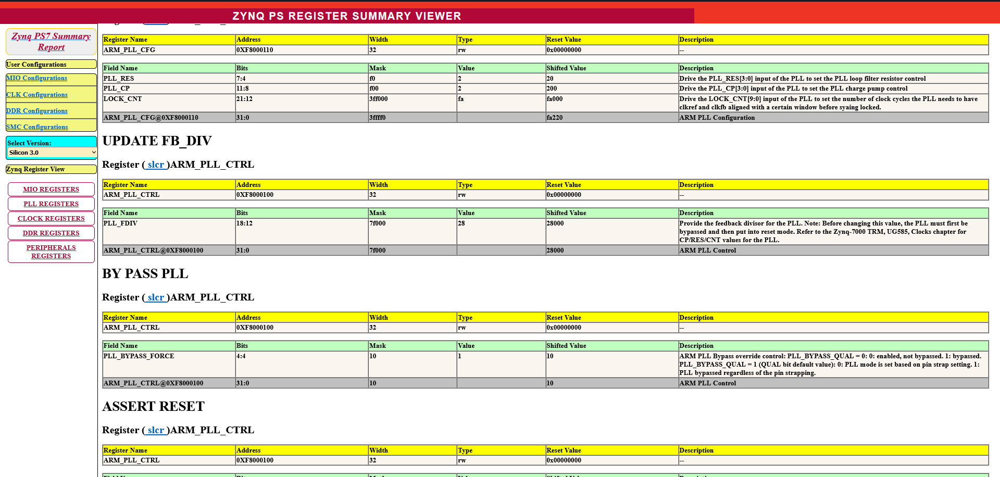
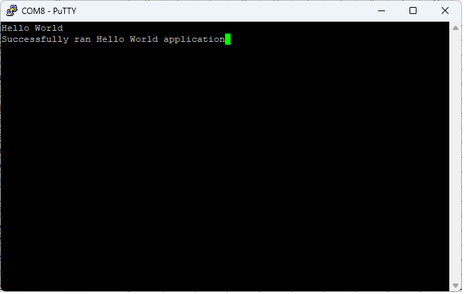

# Лабораторная работа 2

## Настройка PS часть 1 и Hello World

## Обзор

В конце первой лабораторной работы мы в созданный Block Design при помощи IP Integrator добавили процессорную систему ARM. Когда мы дважды нажали на IP в Block Design, появилось средство кастомизации IP (Zynq Re-customize IP tool). В этой лабораторной работе мы продолжим настраивать нашу вычислительную подсистему, добавив туда периферию UART, настроив внутренний источник тактовых сигналов, и установив собственный контроллер памяти DDR. После окончания мы экспортируем нашу систему в SDK и создадим простое приложение Hello World.

## Цель работы

После выполнения лабораторной работы вы сможете:

* Включать и настраивать периферию Zynq PS UART.
* Настраивать клоки и память для Zynq PS.
* Собирать аппаратную платформу.
* Экспортировать сбору в SDK.
* Создавать и запускать Hello_World-приложение.

## Эксперимент 1: Включение и настройка  периферии Zynq PS UART

Для начала включим периферию UART и разместим ее входы/выходы в MIO.

---

### **Обобщенная инструкция:**

Установите напряжение банков LVCMOS 3.3V для Bank 0 и LVCMOS 1.8V для Bank 1. Включите UART1 и подключите ее входы/выходы к MIO[48:49].

---

### **Пошаговая инструкция:**

1. Если еще не открыто, открой созданный ранее проект *ZynqDesign* и откройте Block Design **Z_system.bd**. Дважды нажмите на *Zynq PS* для кастомизации PS. Окно *Zynq Block Design* демонстрирует, что в данный момент никакая периферия или интерфейс Flash-памяти не подключена. На это указывает тот факт, что на всей I/O периферии и Flash-памяти отсутствует галочка, как показно на рисунке ниже. Это также свидетельствует о MIO также ни к чему не подключен.

    

2. В боковой панели окна *Re-customize IP* выберите MIO Configuration и раскройте список **I/O Peripherials**.

    

3. В верху окна *MIO Configuration* находятся настройки напряжения банков. Установите *Bank 0 I/O Voltage* в значение **LVCMOS 3.3V** и *Bank 1 I/O Voltage* в значение **LVCMOS 1.8V**.

    

    На данный момент никакая периферия не выбрана. Заметьте, что список периферий находится не в алфавитном порядке, а в порядке приоритетности в системе сверху вниз или как они насколько ограничено может быть их соединение с MIO. Периферия упорядочена как менее гибка вверху и более гибка внизу, за исключением USB, который может быть подключен только в одном месте.

    Во время работы с платой разработчик должен начать с верху, двигаясь вниз.Разработчик должен осторожно определить, какая периферия должна быть подключена к *MIO*, а какая к *EMIO*. Для упрощения эксперимента мы сфокусируемся только на одной периферии, чтобы показать как проходит весь процесс.

4. Для подключения доступны только два интерфейса *UART*. Установите чекбокс напротив **UART1**. Заметьте, что *UART1* может быть подключен к разным входам/выходам *MIO* и *EMIO* (Extended MIO). Установите значение *I/O* в **MIO48..49**, которое является значением по-умолчанию.

    

5. В боковой панели *Page Navigator* выберите пункт **Zynq Block Design**. Заметьте, что в области *I/O Peripherals* напротив *UART 1* установлена галочка, что говорит о том, что эта периферия теперь подключена.

    

6. В окне с диаграммой *Zynq Block Design* нажмите на область **General Settings** или в боковой панели *Page Navigator* выберите пункт **PS-PL Configuration**.

    

7. Раскройте секцию *General* и удостоверьтесь, ято значение *Baud Rate* установлено в **115200**.

    

---

### **Вопросы:**

* Как вы думаете, для чего нужен *EMIO*?

* Почему в *I/O Peripherals Configuration tool* периферия упорядочена не в алфавитном порядке?

* Вопрос со звездочкой: Если при включении периферии UART включить опцию *Modem Signal*, куда их следует разместить?

## Эксперимент 2: Настройка памяти и клоков в Zynq PS

Перед запуском простейшей программы должны быть настроены еще пара критических элементов Zynq PS. В них входят DDR3-память, так как в этой памяти будет работать наше приложение. Также для нашей системы должны быть правильно сконфигурированы клоки.

### **Обобщенная инструкция:**

Настройте *Memory GUI* для 32 битного интерфейса, используя компоненты памяти Micron DDR3. Настройте клоки для работы CPU на частоте 667 МГц и память на 533 МГц.

### **Пошаговая инструкция:**

1. Нажмите на область **Clock Generation** на диаграмме или выберете пункт **Clock Generation** на боковой панели.

    

2. Нажмите на кнопку **Expand All** на верхней навигационной панели, чтобы увидеть все тактовые сигналы.

    

3. Для большинства устройств значение частоты генератора импульсов соответствует настройкам платы *ZedBoard*. Удостоверьтесь, что значения следующие:

    * *Input frequency* - 33.33333 МГц
    * *CPU frequency* - 666.666666 МГц
    * *DDR frequency* - 533.333333 МГц

    

4. Сейчас нам требуется изменить значение настроек по-умолчанию. Один из *PL Fabric Clocks* включен, однако сейчас мы не используем PL. Выключите его, выставив соответствующий чекбокс в нужное положение.

    

5. В добавок к отключению настроек *PL Fabric Clock* мы также должны отключить подключение AXI к PL. Это делает в *PS-PL Configuration*. Выберите пункт **PS-PL Configuration** и раскройте секцию **AXI Non Secure Enablement -> GP Master AXI Interface**. Отключите там **M AXI GP0 Interface** отключив чекбокс.

    

6. Теперь займемся контроллером памяти. На диаграмме выберите область **DDR2/3, LPDDR2 Controller** или в боковой навигационной области выберите пункт **DDR Configuration**.

    

7. Снова нажмите **Expand All**, чтобы увидеть все параметры памяти. Убедитесь, что чекбокс **Enable DDR** установлен.

    

8. Параметры, которые мы установим для DDR должны соответствовать плате, которую мы используем. Выставьте следующие параметры:
    
    * *Memory Type* - **DDR3**
    * *Memory Part* - **MT41J128M16 HA-15E**

    Обратите внимание на то, что настройки *Memory Part Configuration* автоматически обновятся при выборе *Memory Part*. Если ваше устройство памяти отсутствует в списке предустановленных, выберите **Custom**. Далее будут доступны поля для ручного ввода параметров вашей памяти.

    

9. В секции *DDR Controller Configuration* поле *Effective DRAM Bus Width* должно быть установлено **32-bits**, так как мы используем конфигурацию 2х16 DDR3. Так как мы используем DDR3 на устройствах 7z010 или 7z020 значение полей *ECC* и *Burst Length* предопределены. Обратите внимание, что частота работы автоматически была определена в окне *Clock Configuration* и равняется 533 МГц.

10. Установите чекбокс **Internal Vref**. Значение *Operating Temperature* должно быть **Normal (0-85)**.

    

11. Далее настроим параметры *Training/Board Detail*. В секции *Dram Training* должны быть включены следующие 3 чекбоксы: *Write leveling*, *Read gate*, и *Read data eye*. Определение, что это такое можно найти в *Zynq TRM*, Параграф 10.6.8.

    

    Обратите внимание, есть четыре поля ввода, позволяющие указать информацию о задержке *DQS* к *Clock Delay* (нс) и задержке *Board Delay* (нс) для каждой из четырех байтовых линий. Эти значения помогают алгоритму тренинга найти начальную точку в допустимом окне данных *DDR3*. По умолчанию все задержки равны 0.0. Учтите, что параметры для этих полей индивидуальны для каждой *PCB* и *Zynq package*.

    Значение основано на длине дорожек печатной платы и выбранном *Zynq package*.Vivado понимает, какой package был выбран, но пользователь должен указать значения для длины дорожек печатной платы.

    Как рассчитать эти длины, объясняется в Интернете (Calculating DDR 3 PCB Lengths (ZedBoard)). Если после завершения лабораторной работы у вас останется время, выполните предложенные там упражнения.

    Но в данный момент, чтобы сэкономить время, мы предоставим вам значения задержек.

12. Установите значения **DQS to Clock Delay** и **Board Delay** как показно на рисунке.

    

13. Нажмите кнопку **OK** для окончания настройки Zynq PS.

14. Сохраните текущий *Block Design*.

---

### **Вопросы:**

* Где можно установить скорость интерфейса DDR?

* Откуда Vivado знает настройки для определенных устройств памяти (Memory Part Configuration Settings)? Откуда вы их возьмете для произвольного устройства?

* Какая максимальная скорость для интерфейса DDR3? Вопрос со звездочкой: какая минимальная скорость?

## Эксперимент 3: Сборка аппаратной платформы и экспорт в SDK

На текущем этапе мы настроили базовую аппаратную платформу ARM. Наша конфигурация включает в себя настройки тактовых сигналов и контроллера памяти DDR. У нас также подключена периферия UART. Теперь соберем аппаратную платформу и экспортируем ее в SDK для разработки приложения.

---

### **Обобщенная инструкция:**

Добавьте верхний модуль иерархии (top module). Экспортируйте сборку в SDK.

---

### **Пошаговая инструкция:**

1. Для проверки нашего *Zynq block design* нажмите кнопку **Validate Design**.

    

2. При успешной валидации в окне *Vivado Design* в области *Sources* нажмите правой кнопкой мыши на **Z_system.bd**, далее выберите **Create HDL Wrapper**.

    

3. Vivado умеет управлять сгенерированной оберткой за вас. Однако, если ваш *Block Design* является подмодулем более крупного проекта, может быть создана редактируемая HDL-обертка и инстанцирована прямиком в ваш проект. Для этой лабораторной работы пусть Vivado сама управляет оберткой. Нажмите кнопку **OK**.

    

4. После окончания раскройте список *Design Sources* и дважды нажмите на только что созданную обертку, **Z_system_wrapper.vhd**.

    

5. Теперь наш проект готов к сборке. На боковой панели *Flow Navigator* нажмите **Generate Bitstream**. Заметьте, в этом действии нет необходимости, поскольку в этой работе мы не используем PL. Однако большинство проектов использует, поэтому это считается просто хорошим тоном.

    

6. Vivado предупредит вас, что еще не были выполнены синтез (synthesis) и имплементация (implementation) и спросит о запуске этих шагов. Нажмите **Yes**. В следующем окне нажмите **Ok**. Можете спокойно игнорировать предупреждения о **AXI BFM License** в окне сообщений внизу.

    

7. Это может занять пару минут в зависимости от вашего ПК. Синтез и имплементация происходят в фоне, не пугайтесь, если ничего не появилось. После окончания *Bitstream Generation* выберите **Open Implemented Design**. Нажмите **OK**. Открытие сымплиментированного дизайна позволяет экспортировать *Bitstream* в SDK.

    

8. Из раскрывающегося меню верхней панели управления выберите **File->Export->Export Hardware...**

    

9. В появившемся окне *Export Hardware Platform* нажмите кнопку **Next**. В следующем окне выберите **Include Bitstream** и нажмите кнопку **Next** в текущем и следующем окне. Затем нажмите кнопку **Finish**.

    

10. Из раскрывающегося меню верхней панели управления выберите **Tools->Launch Vitis IDE**.

    

11. В появившемся окне введите следующую директорию, которая будет локальной для вашего проекта. 

    `D:\ZynqHW\2023.1\ZynqDesign\ZynqDesign.sdk`

    Если директории `ZynqDesign.sdk` нет в папке проекта, создайте соответствующую директорию. Нажмите кнопку **Launch**.

    

12. В окне *Vitis IDE* Выберите пункт **Create Platform Project**. В поле *Platform Project Name* введите `Z_system_wrapper`. Нажмите кнопку **Next**.

    

13. В окне *Platform* выберите область **Create a new platform from hardware (XSA)**. В нем с помощью кнопки **Browse..** выберите файл с вашим экспортированным проектом. Убедитесь что поле *Operating system* установлено в **standalone**, а *Processor* в **ps7_cortexa9_0**. Нажмите кнопку **Finish**.

    

14. Используя проводник, откройте папку `ZynqDesign.sdk` и изучите сгенерированные файлы.

    Vivado экспортировало *Hardware  Platform  Specification* для вашей сборки в SDK.

    Тут говорится о файле, которого в новой версии нет, а аналог я не берусь документировать.

    В каталоге `ZynqDesign.sdk\Z_system_wrapper\hw\` файлы **ps7_init.c** и **ps7_init.h** содержат код инициализации для Zynq PS и настройки инициализации для DDR, клоков, PLL и MIO. SDK использует эти настройки при инициализации процессорной системы, чтобы приложение могло быть запущено поверх вычислительной системы. Файл **ps7_init.html** содержит эти настройки в читаемом виде в формате HTML.

    

    Файл **Z_system_wrapper.bit** - это сгенерированный *bitstream* для PL. На данный момент мы не используем PL, поэтому пустой *bitstream* будет инициализировать PL.

## Эксперимент 4: Создания и запуск Hello World приложения

В этом эксперименте мы будем использовать *Application Project* для создания и запуска Hello World приложения.

---

### **Обобщенная инструкция:**

Создайте *Application Project*, использующий сгенерированный до этого *Platform Project*. Сгенерируйте и запустите Hello World приложение.

---

### **Пошаговая инструкция:**

1. В *Vitis IDE* выберите **File->New->Application Project**.

    

2. При появлении *Welcome page* нажмите кнопку **Next**. В окне выбора платформу выберите область **Select a platform from repository**. Выберите созданную до этого платформу. Нажмите кнопку **Next**.

    

3. В поле *Project Name* введите имя проекта **Hello_World**. Нажмите кнопку **Next**.

    

4. В окне *Domain* выберите `standalone on ps7_cortexa9_0`. Нажмите **Next**.

    

5. В появившемся окне шаблонов приложений выберите **Hello World**. Нажмите **Finish**.

    

6. Для сборки проекта в области *Project Explorer* Выберите **Hello_World_System**. автоматически запустится сборка вначале платформы, потом приложения.

    

7. Наше железо уже настроено на работу. Как работать с терминалом еще узнаю.

8. Нажмите правой  кнопкой мыши на наше приложение **Hello_world**. Выберите **Run As->Run Configurations..**

    

9. В нашей лаборатории мы можем запустить приложение двумя способами: удаленно и локально.

    Удаленное подключение:

    a. Для создания удаленного подключения мы должны находиться в локальной сети лаборатории. В окне настройки запуска нажимаем кнопку **New**.

    

    b. В настройках подключения в поле *Target Name* прописываем название подключения, например `remote`. В поле Host прописываем `192.168.215.122`, порт - `60215`. Нажимаем **OK**.

    

    Локальное подключение:

    a. Открываем терминал, например *Tera Term* и настраиваем *COM Port*, используя настройки для вашей платы. ???? Установите *Baud Rate* в значение **115,200**.

10. Выбираем используемое нами подключение в поле *Connection*. Нажимаем **Run**.

    

Теперь наши САПРы инициализируют процессор, загрузят *Hello_World.elf* в память *DDR* и запустят наше приложение.Это должно занять в районе пяти секунд. Можете отслеживать прогресс с помощью прогресс-бара.

Результат работы можно посмотреть в терминале компьютера, подключенного к плате.

---

### **Вопросы:**

* Содержат ли СИшные исходники Hello World'a инициализации Zynq?

* Как Zynq был проинициализирован в нашем эксперименте?

## Источники:

https://www.avnet.com/wps/portal/us/products/avnet-boards/avnet-board-families/microzed/microzed-board-family (только с VPN)

https://www.avnet.com/wps/portal/us/products/avnet-boards/avnet-board-families/picozed/picozed-board-family (только с VPN)

https://www.avnet.com/wps/portal/us/products/avnet-boards/avnet-board-families/zedboard/zedboard-board-family (только с VPN)

https://www.xilinx.com/products/silicon-devices/soc/zynq-7000.html

https://www.xilinx.com/products/design-tools/vitis.html

https://www.xilinx.com/developer/products/vivado.html

https://docs.xilinx.com/r/en-US/ug949-vivado-design-methodology/Introduction

https://docs.xilinx.com/v/u/en-US/ug1046-ultrafast-design-methodology-guide

## Ответы

> Как вы думаете, для чего нужен *EMIO*?

Пины *MIO* относятся к I/O *PS*. *EMIO* позволяет *PL* получать доступ периферии *PS*, которая может соединяться с входам/выходам *PL*

> Почему в *I/O Peripherals Configuration tool* периферия упорядочена не в алфавитном порядке?

Периферийные устройства перечислены в порядке приоритета. Периферийные устройства, находящиеся в верхней части списка, как правило, должны быть подключены в первую очередь и имеют меньше опций для подключения к *MIO*.

> Вопрос со звездочкой: Если при включении периферии UART включить опцию *Modem Signal*, куда их следует разместить?

*EMIO*

> Где можно установить скорость интерфейса DDR?

В окнах *Clock Configuration* и *DDR Configuration*.

> Откуда Vivado знает настройки для определенных устройств памяти (Memory Part Configuration Settings)? Откуда вы их возьмете для произвольного устройства?

У Vivado есть предустановленная библиотека устройств памяти. С каждым выпуском Vivado Xilinx добавляет в эту библиотеку новые устройства памяти. Если вы используете кастомное устройство, эти значения должны быть извлечены из датащита DDR.

> Какая максимальная скорость для интерфейса DDR3? Вопрос со звездочкой: какая минимальная скорость?

533 MHz.

Самый медленная скорость? Это зависит от устройства памяти DDR3. Несмотря на то, что Vivado указывает самую низкую скорость в 10 МГц, внутренняя PLL устройства памяти DDR3 не может работать так медленно. Когда выбрано известное запоминающее устройство, Vivado не позволяет пользователям устанавливать скорость на более низкую. В данном случае 303 МГц (Tck_max = 3,3нс).

> Содержат ли СИшные исходники Hello World'a инициализации Zynq?

Нет.

> Как Zynq был проинициализирован в нашем эксперименте?

Когда вы создали конфигурацию запуска (Run Configuration), появилась вкладка *Target Setup*. Здесь есть поле, указывающее на инициализирующий файл TCL. По умолчанию это значение задано для файла *ps7_init.tcl*, который был создан как часть экспорта в SDK. Внутри этого TCL вы найдете ряд команд XMD, которые инициализируют все регистры точно так, как вы указали в Vivado.
