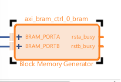

# Лабораторная работа 5

## Добавление периферии в PL

## Обзор

В этой лабораторной работе мы расширим наш *Block Design*, увеличив наше пространство памяти при помощи *PL-based Block RAM (BRAM)*. *BRAM* может быть использована в качестве буфера между PS и PL.

## Цель работы

После выполнения лабораторной работы вы сможете:

* Добавлять *BRAM* из IP-каталога.
* Добавлять интерфейс AXI к Zynq PS.

## Эксперимент 1: Добавление BRAM из IP-каталога

Этот эксперимент покажет, как добавлять PL *BRAM* из IP Catalog.

---

### **Обобщенная инструкция:**

Откройте проект Vivado и *Block Design*. Добавьте *Block Memory* в *Block Design*.

---

### **Пошаговая инструкция:**

1. Для данной работы потребуется проект третьей лабораторной работы. Возможно вы удивитесь, почему мы должны использовать проект третьей работы вместо четвертой. Наши действия в 4-ой работе были направлены не на модификацию нашей аппаратной платформы, а на демонстрацию возможностей TCL в области манипулирования проектом напрямую.

2. Запустите Vivado. Откройте проект третьей лабораторной работы. Откройте *Block Design* **Z_system.bd**.

3. Нажмите правой кнопкой мыши где нибудь в пустом месте *Block Design* и выберите **Add IP...** Альтернатива - нажмите **Add IP** в верхнем навигационном баре.

    

4. Откроется *IP Catalog*. Введите `bram` в поле поиска. Нажмите дважды на **AXI BRAM Controller**, чтобы добавить его в систему.

    

5. Может быть полезно нажать кнопку **Regenerate Layout** на верхнем навигационном баре для того чтобы иметь более красивый вид. Дважды нажмите на **AXI BRAM Controller*.

    

6. Увеличьте *Data Width* до **64** бит. Измените *Support for AXI Narrow Bursts* в **Manual** и установите в **Yes**. Нажмите **Ok**.

    .png)

7. Запустите **Run Connection Automation** в *Designer Assistance*.

    

8. Отметьте галочкой **All Automation**. Нажмите **Ok**.

    

9. Дважды нажмите на *Block Memory Generator*. Удостоверьтесь, что *Memory Type* установлен в *Dual Memory Type**.

## Эксперимент 2: Соединение шины AXI и сборка

Этот эксперимент показывает как добавить блок шины AXI (AXI Smart Connect Block) из IP-каталога.

---

### **Обобщенная инструкция:**

Включите *Master AXI Smart Connect* в PS. Включите *fabric clock* в PS. Соедините все IP с PS.

---

### **Пошаговая инструкция:**

Если внимательно посмотреть на блок *BRAM Controller*, можно заметить порт **S_AXI** в верхнем левом углу. *BRAM Controller* ожидает, чтобы он был *Slave* на шине AXI. Однако для этого нам нужен *Master*. Так как теперь у нас есть логика в PL, мы также должны иметь тактовые сигналы для этой логики.

1. Дважды нажмите на блок **Zynq PS (processing_system7_0)**.

2. Внизу экрана нажмите на зеленый блок **32b GP AXI Master Ports**.

    

3. Отметьте галочкой **M AXI GP0 Interface**.

    

4. Выберите **Clock Configuration** в *Page Navigator*. Нажмите **Expand all**.

    

5. Включите *Fabric Clock 0*, установив соответствующую галочку напротив **FCLK_CLK0**. Установите ее в **50МHz**.

    

6. Нажмите **Ok** для выхода.

7. Теперь мы видим, что наш блок *PS7* имеет соединения *M_AXI_GP0* и *FCLK_CLK0*. Также вновь появился *Designer Assistant*. Нажмите **Run Connection Automation**. Опять выберите **All Automation**.

8. После завершения можете нажать на **Regenerate Layout**. Вы должны увидеть нечто похожее.

    

9. Вы можете дважды нажать на *AXI Smart Connect* и увидеть, что количество интерфейсов Master - 1. Это имеет смысл, так как у нас имеется только один Slave. При добавлении большего количества *Slave IP* просто увеличим количество матеров тут. Закройте это окно.

10. Теперь нам нужно сделать адресное пространство доступным с шины AXI. Для получения доступа к вкладке *Address Editor* выберите **Window->Address Editor** в верхней навигационной панели Vivado. *Designer Assistant* уже назначил адрес. Если делать это вручную, можно использовать кнопку **Assign all**(стрелочка вниз) в навигационной панели *Adress Editor'a*(Сейчас она неактивна). Здесь можно изменить диапазон(Range), если нужно использовать меньшее или большее количество памяти. Можно также изменить смещение адреса(Offset Address). В этом эксперименте мы оставим диапазон 8К, расположенном по 0х4000_0000.

    

11. Вернитесь обратно во вкладку диаграммы (Diagram).

    

12. Далее нам нужно проверить спроектированный дизайн. У Vivado есть надежное средство проверки правил проектирования для блоков Vivado IP Integrator. Выберите **Validate Design**. Нажмите **OK** в окне успешной валидации дизайна.

    

13. Откройте *Block Memory Generator IP* **axi_bram_ctrl_0_bram**, дважды нажав на IP.

    

14. Нажмите на опции *Port A Options* и *Port B Options*, чтобы посмотреть их ширину и глубину данных. Нажмите также на *Summary*, чтобы посмотреть какое количество ресурсов BRAM будет использовать этот IP. Обратите внимание на то, что параметры ширины и глубины данных наследуются от *BRAM Controller IP* и обновляются когда дизайн валидируется.

    

    

    

15. Нажмите **OK**, чтобы принять эти настройки.

16. Сохраните *Block Design*.

17. Сбросьте и сгенерируйте *Output Products*, нажав правой кнопкой мыши на **Z_system_i** в *Design Sources*.

18. Нажмите **Generate Bitstream** в *Flow Navigator*. Нажмите **Yes** чтобы запустить синтез и имплиментацию.

---

### **Вопросы:**

* Какое количество *BRAM'ов* используется *Block Memory Generator'ом*?
* Какой базовый адрес BRAM? Почему он такой?  
* Если добавить больше IP-периферии, куда они будут соединены?

## Дальнейшее изучение

При наличии свободного времени можно также изучить:

* Посмотрите, какие еще IP-ядра есть в каталоге. Обратите внимание, что если вы решите их добавить в дизайн, убедитесь, что убрали их перед выполнением следующей работы.

## Источники:

www.microzed.org

www.picozed.org

www.zedboard.org

www.xilinx.com/zynq

www.xilinx.com/sdk

www.xilinx.com/vivado

www.xilinx.com/support/documentation/sw_manuals/ug949-vivado-design-methodology.pdf

www.xilinx.com/support/documentation/sw_manuals/ug1046-ultrafast-design-methodology-guide.pdf

## Ответы

> Какое количество *BRAM'ов* используется Block Memory Generator'ом*?

2

> Какой базовый адрес BRAM? Почему он такой?  

0x4000_0000, потому что это начало адресного пространства лоя *M_AXI_GP0* (надо обратиться в *Zynq All Programmable SoC User Guide*)

> Если добавить больше IP-периферии, куда они будут соединены?

Надо добавить Master AXI порты в блоке шины AXI для соединения к нему новых слэйвов.
